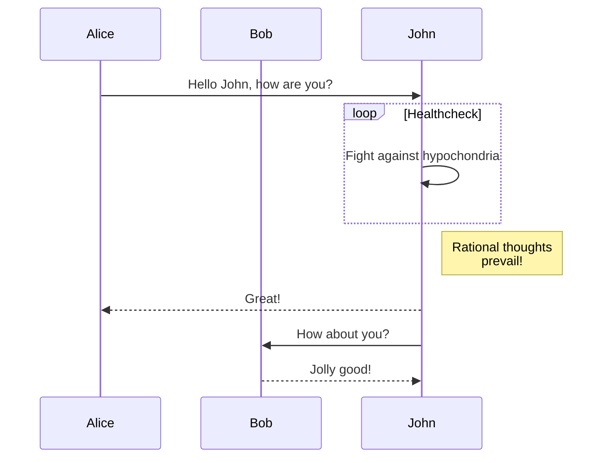

<<<<<<< HEAD
در حال حاضر، هگزترا از [Mermaid](#mermaid) برای نمودارها پشتیبانی می‌کند.
=======
در حال حاضر، Hextra از [Mermaid](#mermaid) برای نمودارها پشتیبانی می‌کند.
>>>>>>> 2cd534b (first2)

<!--more-->

## Mermaid

<<<<<<< HEAD
[Mermaid](https://github.com/mermaid-js/mermaid#readme) یک ابزار نمودار و نمودار مبتنی بر جاوااسکریپت است که تعاریف متنی الهام گرفته از مارک‌داون را دریافت می‌کند و نمودارها را به صورت پویا در مرورگر ایجاد می‌کند. به عنوان مثال، Mermaid می‌تواند نمودارهای فلوچارت، نمودارهای توالی، نمودارهای دایره‌ای و موارد دیگر را رندر کند.

استفاده از Mermaid در هگزترا به سادگی نوشتن یک بلوک کد با مجموعه زبان `mermaid` است:
=======
[Mermaid](https://github.com/mermaid-js/mermaid#readme) یک ابزار نمودار و چارت مبتنی بر جاوااسکریپت است که تعاریف متنی الهام‌گرفته از Markdown را گرفته و به صورت پویا در مرورگر نمودارها را ایجاد می‌کند. به عنوان مثال، Mermaid می‌تواند فلوچارت‌ها، نمودارهای توالی، نمودارهای دایره‌ای و موارد دیگر را رندر کند.

استفاده از Mermaid در Hextra به سادگی نوشتن یک بلوک کد با زبان تنظیم شده `mermaid` است:
>>>>>>> 2cd534b (first2)

````markdown

````

<<<<<<< HEAD
به صورت زیر رندر خواهد شد:
=======
به صورت زیر رندر می‌شود:
>>>>>>> 2cd534b (first2)


نمودار توالی:



<<<<<<< HEAD
برای اطلاعات بیشتر، لطفا به [مستندات Mermaid](https://mermaid-js.github.io/mermaid/#/) مراجعه کنید.
=======
برای اطلاعات بیشتر، لطفاً به [مستندات Mermaid](https://mermaid-js.github.io/mermaid/#/) مراجعه کنید.
>>>>>>> 2cd534b (first2)
